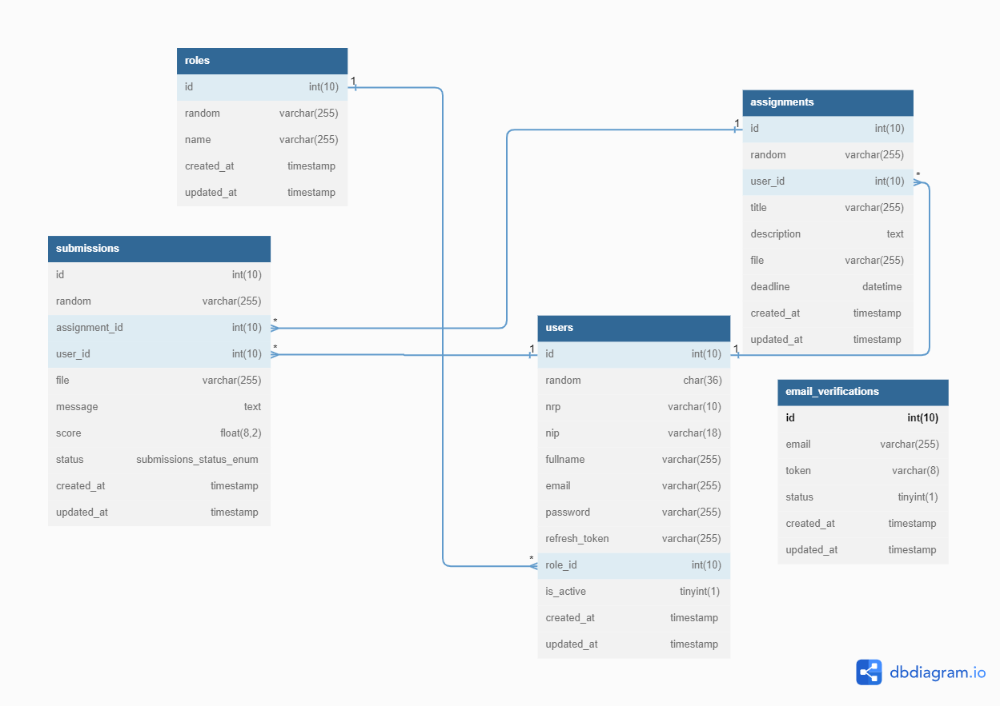
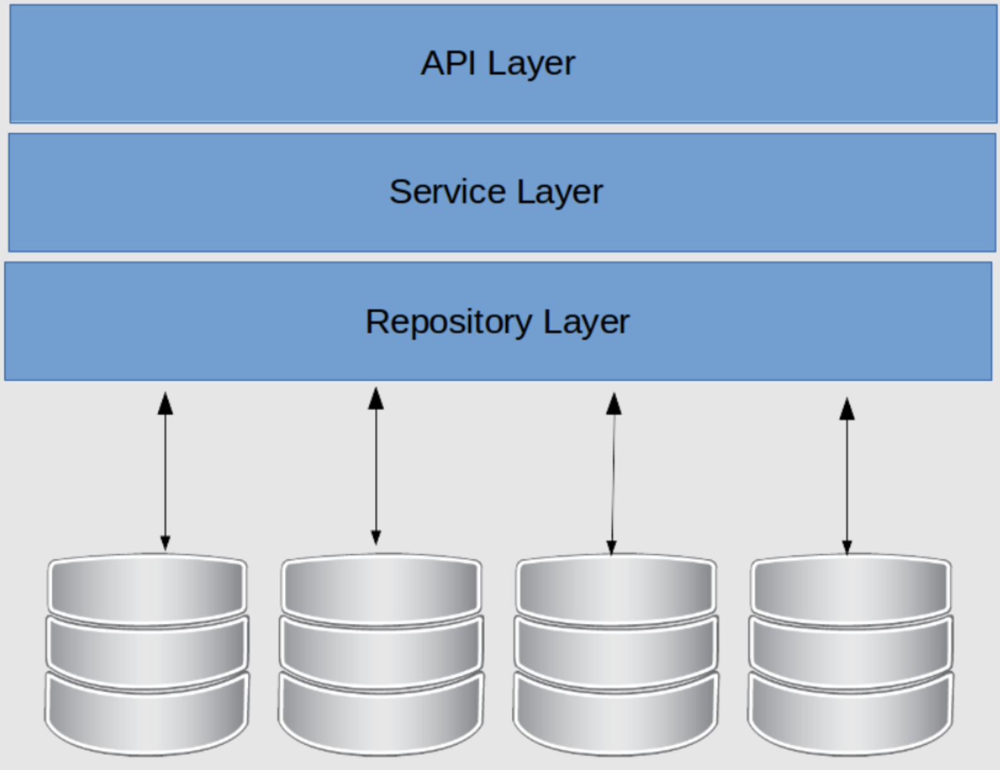

<p align="center"></p>

## About this Project

This project is created for an intership test in DOT Indonesia as a Backend Engineer (Node JS). This project is about e-learning systems. This system has 3 user roles (admin, lecture, and student). Admin manages the system and creates accounts for new lectures. Lecturers can send assignments aimed at students and assess the results of the answers students give. Students can submit answers to assignments given by lecturers and evaluate if the value of the answer is remedial

## Desain Database



## Design Pattern

This project uses a repository pattern. Why use a repository pattern?

1. Flexibility when there is a change in the naming of a table field or a change in the database schema
2. Flexibility when we decide to change ORM, QueryBuilder, or database
3. Ease of finding errors during development

Because I'm separating the business logic and persistence/request logic



1. API Layer (Controller) <br>
   The API layer is a REST API that provides an interface for interacting with applications

2. Service Layer <br>
   The Service layer is responsible for handling the application's business logic.

3. Repository Layer <br>
   The Repository layer is responsible for handling persistence logic. This layer is responsible for sending requests to the database.

## Depedencies

- [TypeScript](https://www.typescriptlang.org/).
- [Express JS](https://expressjs.com/).
- [Knex](https://knexjs.org/).
- [JSON Web Token](https://www.npmjs.com/package/@types/jsonwebtoken).
- [My SQL](https://www.npmjs.com/package/mysql).
- [Bcrypt](https://www.npmjs.com/package/bcrypt).
- [Cookie Parser](https://www.npmjs.com/package/cookie-parser).
- [Cors](https://www.npmjs.com/package/cors).
- [DotENV](https://www.npmjs.com/package/dotenv).
- [Express Validator](https://express-validator.github.io/docs).
- [Morgan](https://www.npmjs.com/package/morgan).
- [Multer](https://www.npmjs.com/package/multer).
- [Node Mailer](https://nodemailer.com/about/).
- [Random String](https://www.npmjs.com/package/randomstring).
- [UUID](https://www.npmjs.com/package/uuid).

# Tutorial Github

## How to Cloning Repository

1. On your computer open the console/command prompt
2. Enter the Following Command
```
git clone https://github.com/milhamap/Dot-Indonesia-Challange.git
```
3. Enter the Clone Results Folder
```
cd Dot-Indonesia-Challange
```

# How to Use Application

1. Install Node Package Manager Terlebih Dahulu <br>
   [Download disini](https://nodejs.org/en/download/)
2. Install all javascript dependecies Terlebih Dahulu
```
$ npm install
```
3. Copy file `.env.example` and rename this file to `.env`
```
cp .env.example .env
```
4. Create a new database in phpmyadmin with the name  `dbelearning`
5. Create new folder directory with name `public/uploads/assignments` and `public/uploads/submissions`
6. Migration database using `knex` command below
```
$ knex migrate:latest --env development
```
7. Seeder database using `knex` command below
```
$ knex seed:run --env development
```

## How to Run
1. Open 2 terminal
2. Terminal 1 uses git bash to compile the TypeScript into JS File (watch mode) with command below
```console
$ npm run ts
```
3. Terminal 2 to run the server with command below
```console
$ npm run dev
```

## API Documentation

You can access this project API documentation [here](https://documenter.getpostman.com/view/21604420/2s93eSZF5b)